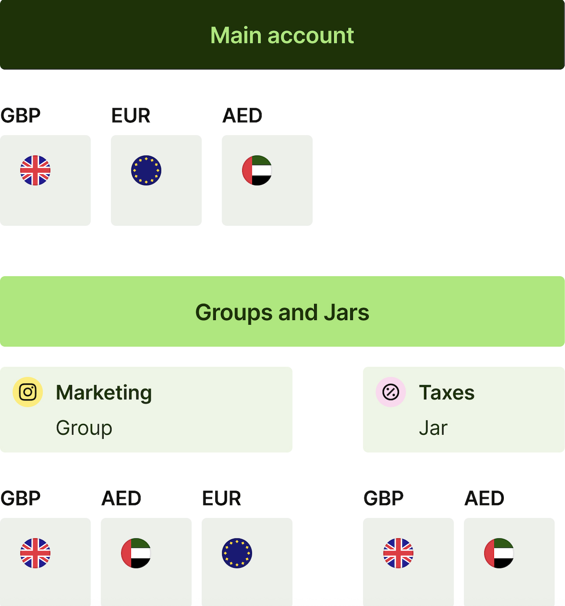

# Wise Business — Великобритания: платёжная полезность без кредитного продукта

Дата проверки: 2026-10-09, Europe/Moscow. Статус: публичный профиль принят с пробелами. После лимита предыдущего чата подготовленный текст не найден; профиль восстановлен по заново прочитанным первичным источникам. Ранее заявленный объём сбора не выдан за сохранённую базу.

## Вывод по кейсу

Wise помогает отделить ценность финансового сервиса от кредитной монетизации. Компания может начать с международного платежа, сохранить основной банк, затем использовать инструменты счетов и командных расходов. Кредит и овердрафт Wise Account прямо исключены. Наличие полезных операций не даёт основания считать такую базу готовым кредитным портфелем. BB-C0392 / BB-S0360,BB-S0354; BB-C0384 / BB-S0355; BB-C0399 / BB-S0355,BB-S0359,BB-S0363. UK, текущие условия; fact о продукте / Medium, экономический переход / hypothesis / Low.

## Клиент и роль провайдера

UK-договор обслуживает предпринимателей и разные организации через Wise Payments Limited. Средства защищаются обособлением; это иной механизм, чем страхование банковского вклада. Локальные реквизиты направляют деньги в Wise Account и не превращают каждую валюту или бюджет в отдельное юридическое лицо. При интерпретации Business-разреза отчётности форма клиента не установлена: категория выбирается при регистрации. BB-C0383 / BB-S0354; BB-C0385 / BB-S0354,BB-S0355; BB-C0396 / BB-S0363.

## Почему клиент приходит

Причина подключения — конкретный международный расчёт или получение оплаты. Регистрацию, набор функций и саму транзакцию оплачивают по разным правилам. UK setup — 50 GBP (BB-M0362); переводы и конвертация рекламируются от 0,24% (BB-M0363, BB-M0364). Нижняя граница не равна цене конкретной операции или среднему доходу. Канальная стоимость, доля пришедших через бухгалтера и доля перенёсших основной денежный поток не раскрыты. BB-C0386 / BB-S0353.

## Подключение и первая полезная операция

| Шаг | Действие | Наблюдаемая граница |
|---|---|---|
| Профиль | Указать бизнес и представителей; пройти проверки | Документированный шаг; реальный KYB не наблюдался |
| Первая оплата | Выбрать поставщика и источник денег | Внешний банк допустим; способов оплаты нельзя гарантировать всем |
| Первое поступление | Дать покупателю подходящие реквизиты | Реквизиты не самостоятельный банковский депозит |
| Повторение | Счёт → черновик → проверка и платёж | Черновик не доказательство завершения или автономного исполнения |

Источники и этапы: BB-J0223–BB-J0230; BB-C0385 / BB-S0354,BB-S0355; BB-C0392 / BB-S0360,BB-S0354; BB-C0390 / BB-S0359. Все шаги officially_documented, не observed.

## Продукты, использование и эффект

Подтверждены инструменты подготовки/отправки счёта, отслеживания дебиторки, загрузки и пересылки документа, пакетных платежей, связи с бухгалтерией, бюджетов и прав команды. Реестр содержит отдельные записи BB-F0107–BB-F0119. Приём карт новым клиентом помечен no: действующая справка ограничивает предложение витрины. Числа из рекламных примеров не включены в показатели клиентов.

Ручной статус «оплачен» в счёте требует отдельной проверки реального поступления. В кредитной модели нельзя считать такой статус заменой банковской транзакции. Источники: BB-C0389 / BB-S0358; BB-C0387 / BB-S0356; BB-C0388 / BB-S0357.

## Переход к кредитованию

Кредитного перехода внутри Wise Account нет по справке. Переносимая гипотеза относится к привлечению через полезную задачу, затем к самостоятельному решению другого кредитора. Ему нужны подтверждённые операции, согласия, долг, качество клиента и собственная экономика. Доход от платёжного сервиса и инвестиционной функции нельзя автоматически оценивать как банковский доход от кредитования или депозитов. BB-C0384 / BB-S0355; BB-C0395 / BB-S0352,BB-S0353; BB-C0399 / BB-S0355,BB-S0359,BB-S0363.

## Масштаб и экономика

| Показатель | Значение | Охват и источник |
|---|---|---|
| Активные клиенты | 18,9 млн | Группа FY2026, личные + Business; BB-M0366 |
| Чистая выручка | 2 502,8 млн USD | Группа FY2026, US GAAP; BB-M0368 |
| Прибыль до налога | 660,4 млн USD | Группа FY2026; BB-M0369 |
| Активные Business | 572 тыс. | Глобальный Q4 FY2026, трансграничная операция; BB-M0373 |
| Business-объём | 19,5 млрд USD | Глобальный квартальный поток; BB-M0374 |
| Business-остатки | 11,2 млрд USD | Глобальный конец квартала, без Assets; BB-M0375 |

BB-C0396 / BB-S0363; BB-C0397 / BB-S0364,BB-S0363. Это показатели официального релиза, не самостоятельно проверенная аудированная UK-когорта. Затраты на активную компанию, удержание UK-юрлиц и продуктовая прибыль неизвестны. Не сравнивать предварительные GBP underlying показатели с итоговыми USD net revenue.

## Новые решения и экраны

Июльская статья описывает загрузку счетов и пересылку по email как новые возможности. Дата публикации 21 июля 2026 года не устанавливает точную дату запуска у каждого клиента. Время черновика меньше минуты — заявление компании (BB-M0377), а не измеренный срок. BB-C0390 / BB-S0359; BB-C0391 / BB-S0359.

BB-V0060: официальная схема, UK / проверка 2026-10-09; подтверждает структуру бюджетов, не внешний вид закрытого приложения. Иллюстрация черновика просмотрена через web, но не скачана (403). Закрытые регистрация, согласование и исполнение имеют screen evidence missing. Реальный клиентский путь не пройден.

## Данные против, применимость и пробелы

Ограничения: недоступность приёма карт новым компаниям, отсутствие кредитов, условная доступность способов пополнения, разные определения активности и инвестиционный риск. Они не доказывают слабость платёжной модели, но ограничивают вывод о кредитном росте.

Для другого банка гипотеза: разрешить начало с полезной задачи и части операций. Проверять её по фактическим платежам и общей прибыли компании за согласованный горизонт. Возобновить сбор при появлении UK B2B-когорт или изменения доступности карточного приёма. BB-G54–56: локальная экономика; доступность/реквизиты; закрытые экраны и результат автоматизации.

- [x] Числа и существенные тезисы связаны с реестрами.
- [x] Разделены страна, финансовый период, группа и B2B.
- [x] Эффект не присвоен функции; расхождения сохранены.
- [x] Экраны классифицированы; закрытый опыт неизвестен.
