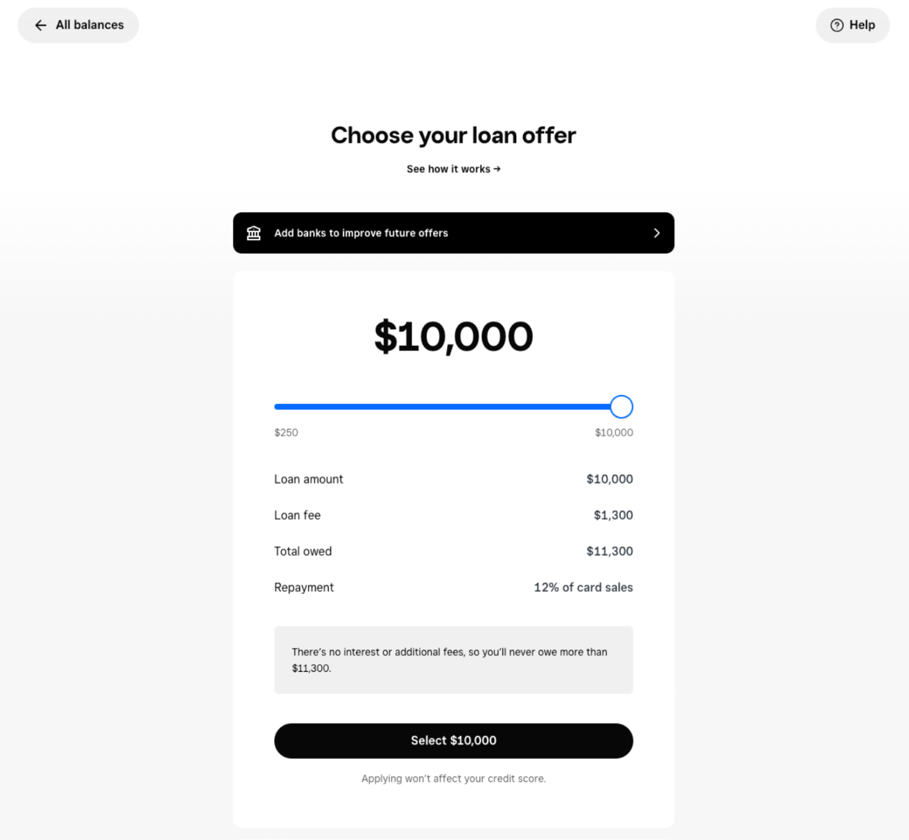
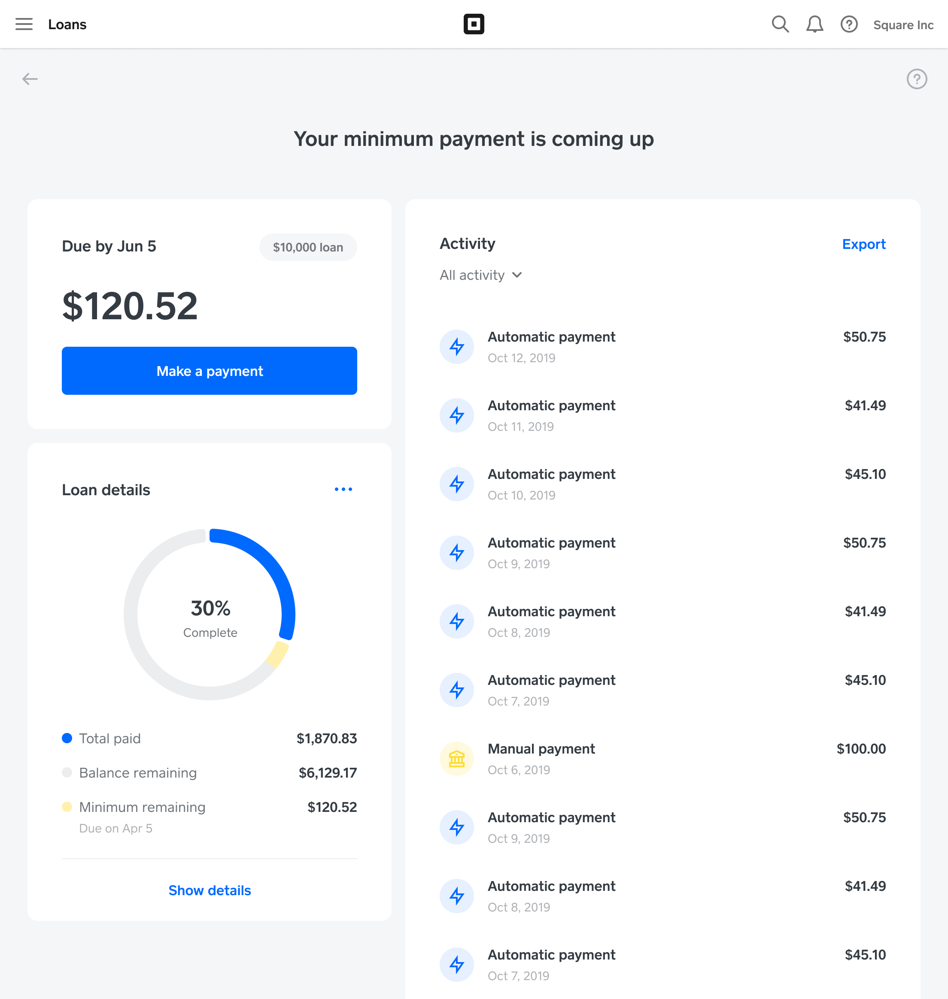
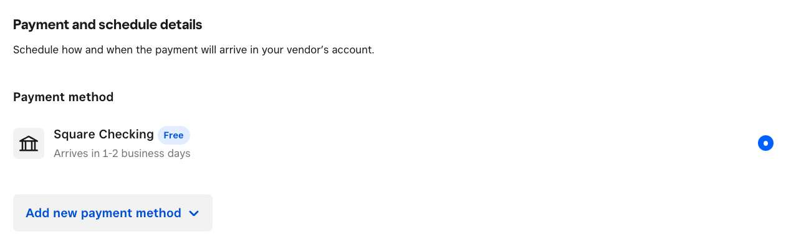

# Square — United States: платежный вход, банковские задачи и кредит

Проверено 7 октября 2026. Статус: **done в объёме публичного профиля BB-05**. Сценарий — малый бизнес, sole proprietor либо зарегистрированная компания, подключающий приём платежей и затем использующий финансирование. Проверены локальные product/help/terms, институциональная карточка FFIEC и целевые разделы раскрытий Block. Реальная заявка не подавалась. Это самостоятельный кейс; приоритеты инициатив для Озон Банка будут сопоставлены в BB-10.

## Вывод по кейсу

**Square показывает альтернативу обязательному счёту перед кредитом: клиент приходит за приёмом платежей и операционным ПО, а предложение финансирования возникает на основе наблюдаемой деятельности.** Деньги можно получить во внешний банк. Собственный Checking добавляет скорость доступа к поступлениям и финансированию, но не является необходимым условием этого кредитного пути. Документированные звенья — платежи, оценка, приглашение, выбор суммы и обслуживание из продаж. Не доказаны снижение стоимости привлечения, прирост удержания и прибыль конкретной когорты. BB-C0176,0179,0184,0208.

Вторая полезная линия — решение задач после получения выручки: резервирование налога, оплата поставщиков, управление карточным долгом, операционные подсказки. Она расширяет количество причин возвращаться в интерфейс. Однако функции не доказывают, что бизнес перенёс основной счёт или стал активным заёмщиком. Для будущего сравнения следует разделять «привлечён в платёжный сервис», «пользуется финансовыми задачами» и «получил кредит».

Старый [кредитный разбор](../../us/square_loans.md) просмотрен как исходная гипотеза. Нынешний профиль исправляет его чрезмерно сильные выводы: документы могут понадобиться, низкий CAC не измерен, продажа кредитов не устанавливает полное освобождение от риска. Старые внешние ссылки на изображения не признаны проверенным UI текущего исследования. Три новых иллюстрации сохранены отдельно.

## Клиент и роль провайдера

Square/Block обеспечивает интерфейс платежей и бизнес-инструментов. SFS — действующий nonmember bank, застрахованный FDIC; роль originator Square Loans подтверждается раскрытием Block. FFIEC независимо подтверждает банковский статус, но не кредитную экономику. Checking предоставляется Sutton Bank, Credit Card — Celtic Bank в сети American Express. Savings имеет соглашение с SFS и sweep в Program Banks. Homegrown Expansion Capital — отдельное партнёрское предложение. BB-C0185,0190,0191,0194,0201; BB-S0138,0154.

Это важно для интерпретации продукта: общий бренд и единый Dashboard не означают единый договор, фондирование либо держателя риска. Особенно нельзя автоматически считать Savings фондированием именно того кредитного портфеля, который виден в отчётности. Для проданного кредита индивидуальный договор передачи риска не получен. Для Homegrown не установлены полный юридический состав стороны договора и индивидуальная цена.

По документам допускаются sole proprietors и зарегистрированные формы бизнеса; сведения для заявки различаются. Не следует применять условия одного личного налогового идентификатора ко всем корпорациям. На этапе KYB собираются данные бизнеса и заявителя, сведения о владельцах от 25% либо управляющем; запрос дополнительных подтверждений остаётся возможным. BB-C0177; BB-M0103.

## Почему клиент приходит

Первичная задача — принимать оплату и вести операции: товары, касса, платежи и сотрудники. Внешний счёт позволяет сохранить банковские отношения и начать платёжный сценарий отдельно. Не каждому способу приёма платежей нужно отдельное приобретаемое устройство. Публичный guide описывает настройку, но не измеряет долю клиентов по источникам трафика, рекомендациям, аппаратным продажам или стоимости канала. BB-C0176; BB-S0127,0129.

Тарифная лестница тоже создаёт несколько мотивов: начать с базовых задач, затем платить за расширенный набор. В US Free стоит $0, Plus $49, Premium $149 за локацию в месяц. Для Free очный карточный платёж имеет компонент 2,6% и $0,15 за транзакцию; стоимость оборудования и дополнений отдельна. Это компоненты цены, а не средняя стоимость обслуживания бизнеса. BB-M0098–0102; BB-C0178.

Гипотеза механизма: полезная ежедневная операция создаёт данные раньше, чем клиент решит взять кредит. Контрпроверка — клиент может принимать платежи нерегулярно или иметь слишком мало истории, а нужда в финансировании не означает наличие приглашения. Такой вход расширяет наблюдаемый бизнес, но не равен открытому кредитному каналу для всех желающих.

## Подключение и первые операции

| Этап | Действие и данные | Документированное доказательство | Неизвестно |
|---|---|---|---|
| Регистрация | Тип бизнеса, данные компании и личности | BB-J0067; BB-S0127,0128 | Реальное время KYB и доля отказов |
| Расчёты | Верификация внешнего банка для перечислений | BB-J0068; BB-C0176 | Доля полностью перенесённых потоков |
| Первая операция | Настройка товаров и приём платежа | BB-J0069 | Конверсия зарегистрированных в регулярных мерчантов |
| Приглашение | Предложение в Dashboard/email | BB-J0070 | Число юрлиц с предложением и funded conversion |
| Дополнительные данные | Добровольная связь основного банка | BB-J0071; BB-C0181 | Incremental lift модели при одинаковом риске |

Общий путь основан на документации, не на пройденном тестовом аккаунте. Не установлены реальные интервалы между этапами и порядок всех экранов для каждой юридической формы. Счёт, платёжный сервис и кредитная заявка не слиты в один условно «мгновенный onboarding».

## Продукты и функции

| Задача | Решение | Доступность и ограничение | Использование / эффект | ID |
|---|---|---|---|---|
| Принимать выручку | POS/payments, тарифная лестница | US; комиссии отдельно | Нет сопоставимой активной банковской когорты | BB-F0036 |
| Получить оборотные средства | Invitation + slider | Отбор модели, не заявка для любого бизнеса | Offer count не funded count | BB-F0037,0038 |
| Дополнить оценку | External bank data | Добровольно, будущие предложения | Lift не раскрыт | BB-F0039 |
| Быстрее использовать деньги | Checking | Отдельный Sutton onboarding | Причинная миграция потоков неизвестна | BB-F0040 |
| Резервировать налог | Savings tax folder | Настройки налога, не декларация | Adoption/экономия неизвестны | BB-F0041 |
| Обслуживать карточный долг | Smart Repayment | Autopay/minimum сохраняются | Эффект на просрочку неизвестен | BB-F0042 |
| Платить поставщику | Bill Pay + кредитная карта | Activated Payment Services; разные funding fees | Net benefit индивидуален | BB-F0043 |
| Управлять операциями | Managerbot | Поддерживаемые сегменты, одобрение действий | Объявление/документация, не causal uplift | BB-F0044,0045 |
| Открывать локации | Homegrown pilot | Отдельный партнёр и eligibility | Использование не раскрыто | BB-F0046 |

Bill Pay превращает задолженность перед поставщиком в конкретный момент финансового выбора: загрузить счёт, проверить распознавание, выбрать источник, подтвердить оплату. Поставщик может получить ACH/check без приёма карты. Карточное финансирование стоит 2,9%; advertised reward Square Card Bill Pay — 3%, обычных покупок — 1,5%. Эти числа не доказывают положительную доходность клиента: остаются проценты, условия rewards и возможность cash-advance классификации issuer. Bank/Checking funding описано без комиссии Bill Pay. BB-C0196–0198; BB-M0119–0121.

Важное ограничение входа: договор требует activated Payment Services account. Это не подтверждённый самостоятельный AP-only канал для любого внешнего бизнеса. Нельзя использовать этот кейс как доказательство привлечения бухгалтерского клиента без платёжного подключения. BB-S0147.

## Переход к кредитованию

Кредит приглашательный; аккаунты оцениваются автоматически. Общая помощь указывает 20 дней использования за год и ориентир $10 тыс. объёма, а мартовский релиз допускает некоторые новые предложения в первые 5 дней. Это различающиеся модели, не гарантия выдачи каждому новому клиенту. Компания сообщает рост активных предложений более чем на 50% между февралем2025 и февралем2026; сравнение не показывает число одобренных или новых заёмщиков. BB-C0180,0189; BB-M0104–0107; BB-X0017.

Подключение внешнего банка через Plaid может улучшать будущие предложения, но не обещает изменить текущий оффер. Отзыв доступа к данным отдельно от отзыва ACH-разрешения: согласие на анализ и право взыскания нельзя смешивать. BB-C0181,0182.

В dedicated help сумма составляет $100–500 тыс.; pricing page содержит максимум $350 тыс. Несогласованность сохранена, действующее индивидуальное предложение имеет приоритет для клиента. Slider меняет сумму, fee и удержание; ручное повышение лимита не обещается. Заявка требует личных и бизнес-сведений, иногда дополнительных документов. Заявлены review 1–2 рабочих дня и external funding 1–3 после одобрения; это рекламируемые интервалы, не измеренный SLA. BB-C0183,0184; BB-M0108–0112; BB-X0018.

Фиксированная плата не уменьшается при раннем возврате. Удержание идёт из gross sales, включая налоги и чаевые, но обязательные минимумы и конечная договорная дата сохраняются. При недостаточном погашении возможны дополнительное списание и повышение удержания. Общая публичная помощь не устанавливает универсальную длительность всех договоров. BB-C0187; BB-X0021.

Залог не нужен для сумм до $100 тыс. включительно; выше возможен security interest/UCC. Personal guarantee требуется выше $250 тыс. Эти границы не означают отсутствие кредитной проверки. Повторное предложение не гарантировано, а остаток старого долга может уменьшить чистый приток от нового займа. BB-C0186,0188; BB-M0113,0114.

Каждое документированное звено имеет источник; недоказанное звено — бизнес-результат. Возможность видеть продажи не подтверждает, что модель точнее конкурента при одинаковом loss budget. Автоматическое удержание уменьшает ручные действия, но не делает риск нечувствительным к падению оборота.

## Масштаб, активность, экономика и риск

| Показатель | Значение | Период / scope | Как трактовать | ID |
|---|---|---|---|---|
| Исторические loans/advances | Более 4 млн; principal более $32,8 млрд | С мая2014 до FY2025; глобальный mixed history | Не уникальные US клиенты и не stock | BB-M0124,0125 |
| Square gross profit | $1,160 млрд | Q2 2026, глобальный сегмент | Не чистая кредитная прибыль | BB-M0126 |
| Square GPV | $72,848 млрд; US доля 78% | Q2 2026; net refunds, rounded share | Не group GPV и не число юрлиц | BB-M0127,0128 |
| Commercial HFI / allowance | $488,860 млн / $32,252 млн | На 30 июня2026 | Остатки; primarily Square Loans | BB-M0129,0130 |
| Commercial HFS | $676,750 млн | Та же дата | Другая классификация остатка | BB-M0131 |
| Writeoffs / recoveries | $14,943 млн / $3,652 млн | Q2 2026, commercial HFI | Отдельные потоки | BB-M0132,0133 |
| Square Loans sold / gain | $1,2 млрд / $69,1 млн | Q2 2026 | Поток продажи / признанный gain | BB-M0134,0135 |

10-Q неаудированный. Большинство Square Loans продаётся инвесторам; часть остаётся. Нельзя складывать категории и объявлять результат полным US-портфелем. «Immaterial» просрочка не равна нулю. Групповой рост consumer losses не характеризует SME. BB-C0204,0205; BB-S0154.

Заявление компании о cohort loss rates ниже 4% сохранено как source-reported: знаменатель и зрелость не позволяют сопоставить его с CoR либо NPL. Не рассчитана доходность выдачи по sale gain: отсутствуют соответствующие расходы, retained risk, funding и когорта. BB-C0206; BB-M0136.

Следовательно, раскрытия подтверждают масштаб сегмента и наличие продажи кредитов, но не замыкают цепочку «привлечение→активность→заём→прибыль». Нужны одинаковые география, юридические лица, окно наблюдения и vintage. Связь мерчантов с потребительской Cash App базой для этой цели не используется.

## Клиентские экраны

Ниже **официальные иллюстрации**, скачанные и визуально проверенные. Это не реальные предложения и не наблюдённые клиентские сессии. Суммы, проценты и даты примеров исключены из metrics. Происхождение и хеши — [manifest](../../../assets/b2b_banking/square/manifest.json).

BB-V0015 / BB-J0072: slider, fee, total owed, repayment share и CTA подключения банка для будущих предложений. Показывает компоновку решения, не актуальную цену конкретного займа.

BB-V0016 / BB-J0076: предстоящий минимум, manual payment, progress и activity. Демонстрирует, почему sales-linked repayment нельзя описывать как отсутствие обязательных платежей. Пример имеет внутренние даты; они не дают текущего графика договора.

BB-V0017 / BB-J0081: Checking option и добавление метода оплаты. Не показывает весь перечень текущих методов. Onboarding, Checking и Managerbot имеют отдельные missing records BB-V0018–0020.

## Новые и изменившиеся решения

Март2026: расширенные модели и короткие предложения новым/сезонным мерчантам. Апрель2026: Managerbot open beta. Май2026: Homegrown expansion pilot с advertised максимумом $1 млн, отдельным от Square Loans. Август2026: card-funded Bill Pay refresh. BB-S0151,0148,0152,0144; BB-M0123.

Managerbot готовит операционные действия и требует подтверждения продавца; текущая помощь описывает purchase orders из invoice, кампании, изменения и возможность отмены. При запросе функции вне подписки предлагается осознанный переход на план. Человеку можно передать резюме обращения. Это интересный механизм связи задачи, продуктового предложения и поддержки, но не подтверждённый источник дополнительной прибыли. AI terms требуют проверки результата; автоматическое кредитное решение данным кейсом не доказано. BB-C0199,0200.

Savings ratechart действует с 24 сентября: 1% APY ниже $10 тыс. баланса, 4,25% при достижении порога. Августовские 3,5% исторические. Проверка даты и tier предотвращает ложное сравнение. Tax folder резервирует сумму по tax settings; не доказаны налоговая подача и перечисление. BB-C0192,0193; BB-M0115–0118; BB-X0019.

Smart Repayment карты позволяет добровольное удержание до 15% ежедневных продаж. Сохраняются autopay, минимум и возможные проценты на переносимый остаток. Его нельзя описывать как безусловно беспроцентный оборотный кредит с погашением только при выручке. BB-C0194,0195; BB-M0122.

## Данные против и применимость механизма

Отбор ограничивает доступ; дополнительная верификация сохраняется; снижение продаж ухудшает обслуживание; покупатели кредитов создают зависимость фондирования. Pricing/loan limit mismatch не устранён. Rollout timing внешнего Bill Pay reconciled по текущим terms/help, но точный момент запуска неизвестен. Checking в Bill Pay agreement — prepaid, не DDA. BB-X0017–0022.

Гипотеза переноса — привлекать бизнес решением частой задачи и собирать разрешённые данные, затем предлагать финансирование в момент потребности. Предпосылки: ценное платёжное/операционное предложение, законный доступ к потокам, независимый риск-отбор, прозрачное погашение, договорная инфраструктура и funding. Российские разрешения и право списания в этом профиле не исследованы.

Для пилота важна раздельная проверка: полезность задачи измеряется повторным использованием; кредитный мост — долей клиентов с offer/funded при одинаковых правилах; экономика — маржинальным результатом зрелой когорты с потерями и расходами. Такой дизайн не принимает популярность функции за доказательство кредитного успеха. Результаты Square не дают готового ROI другого банка.

## Пробелы и приёмка

BB-G33 — сопоставимые US cohorts и unit economics. BB-G34 — индивидуальные договоры, программа новых моделей, partner/legal risk. BB-G35 — complete UI и rollout adoption/causal effect. Поиск ограничен перечисленными первичными источниками; partner destination failed, annual PDF просмотрен лишь целевым поиском, для чисел использован HTML10-K. Это явные границы приёмки, не утверждение отсутствия сведений во всём интернете.

- [x] Тезисы BB-C0176–0208 и числа BB-M0098–0136 связаны с реестрами.
- [x] География, периоды, scope, stock/flow и роли разделены.
- [x] 11 features, 20 steps, 6 screen records и 6 contradictions сохранены.
- [x] Три иллюстрации проверены; закрытый UI отмечен пробелом.
- [x] Очередь: 6/14 приняты, BB-05 4/12; следующий Toast US.

Источники и locator: [sources.csv](../../../data/b2b_banking/sources.csv), BB-S0127–0160. Приёмка не закрывает BB-06–12; итоговый русский PDF будет собран после синтеза и проверки всей выборки.
