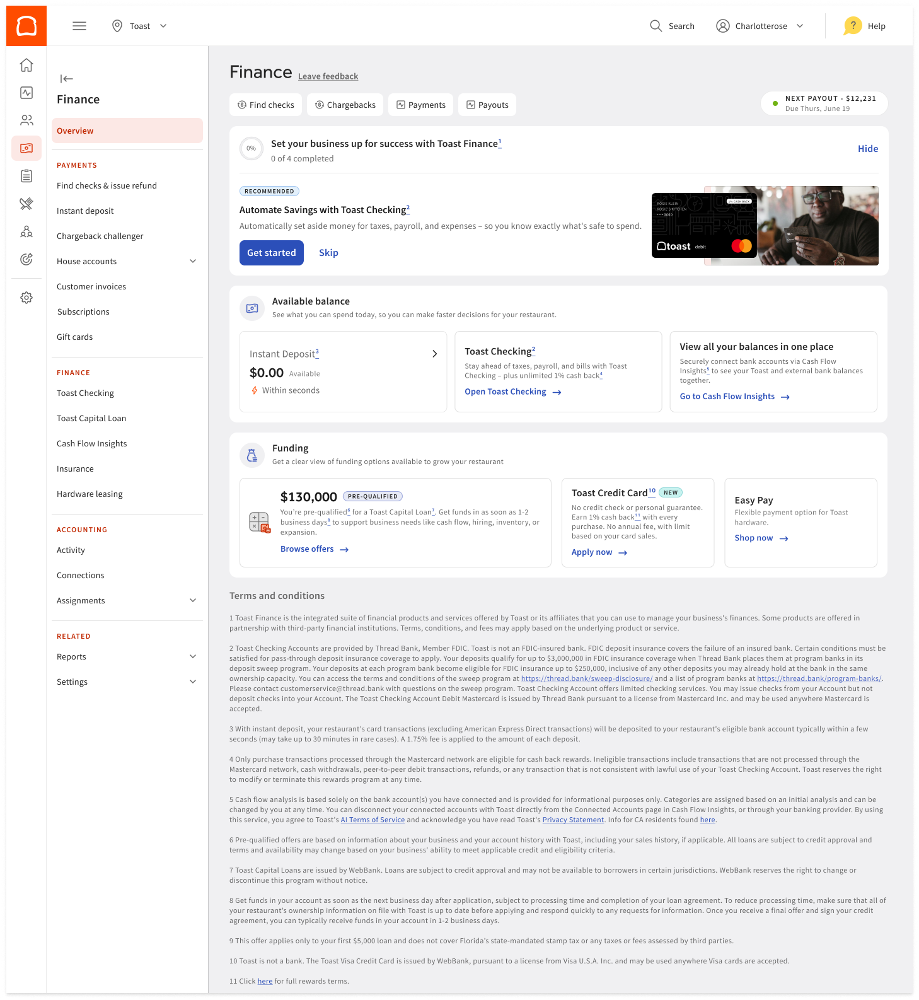
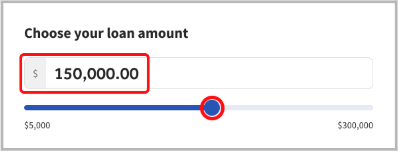
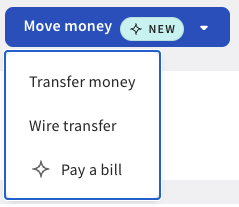

# Toast — United States: ресторанные операции как вход в финансирование

Проверено 7 октября 2026. **done в объёме публичного профиля BB-05**. Сценарии: ресторанный бизнес переходит на Toast; действующий мерчант подключает финансовые задачи и получает кредит; отдельные ограниченные программы Welcome и Conditional Approval. Статус не означает полный договорный аудит или завершение общего исследования.

## Вывод по кейсу

**Toast привлекает бизнес управлением рестораном и платежами, а затем предлагает банковские задачи и кредит. Ограниченный Welcome Loan добавляет обратную последовательность: условное кредитное одобрение до перехода на Toast, выдача после подключения и начала обработки платежей.** Это два разных механизма. Собственный Toast Checking не является обязательным для стандартного кредитного пути, но нужен для описанного Bill Pay. BB-C0209,0218,0220,0226,0240.

Самая интересная продуктовая идея — разделить кредитное решение и момент получения денег. Conditional Approval позволяет позднее выбрать сумму и срок; короткий срок может уменьшить доступный максимум. Такой механизм полезен при неопределённых затратах проекта, но остаётся одной выдачей с повторной проверкой, а не возобновляемой линией. BB-C0222,0228.

Экономическое ограничение столь же существенно: Toast получает плату за обслуживание и результат портфеля, несёт обязательства по выкупу части проблемных кредитов и приобретает некоторые непросроченные займы. Партнёрский банк не устраняет риск платформы. Успех всего бизнеса и наличие полезного интерфейса не подтверждают прибыль отдельной кредитной когорты. BB-C0231–0234.

## Вопросы и проверка гипотез

Рынок — US; период — действующие публичные условия на дату проверки, FY2025 и Q2 2026 для финансов. Основной сегмент — ресторанные малые предприятия; enterprise и retail в раскрытиях не приравнены к SME. Обозначения юридических форм различаются по продукту.

| Гипотеза | Что могло её опровергнуть | Результат |
|---|---|---|
| Операционный сервис создаёт вход в кредит без собственного банковского счёта | Обязательное открытие Checking для любого займа | Поддерживается для стандартного пути; Welcome имеет иной порядок, BB-C0220,0226 |
| Удержание из продаж упрощает обслуживание | Отсутствие конечных обязательств могло бы сделать долг полностью зависимым от выручки | Гибкость подтверждена; максимум срока и договорные минимумы остаются, BB-C0224 |
| Частые задачи улучшают удержание и кредитный результат | Только описание функций без сопоставимых когорт | Наличие подтверждено, причинный эффект недостаточно доказан, BB-C0237,0240 |
| Роли и риск можно разделить | Ошибочное отнесение всех активов и гарантий к банку | Роли установлены по раскрытиям; unit economics неизвестны, BB-C0231,0232 |
| Новые AI-функции имеют проверенную доступность | Анонс, beta или результат прежнего продукта | Смешанный статус; новые релизы не выданы за зрелый эффект, BB-C0235–0237 |

## Клиент и роль провайдера

Toast — поставщик ПО, оборудования и интерфейса; pricing FAQ называет его payment facilitator, работающим с процессорами. Toast Capital loans выдаёт WebBank. Toast продаёт и обслуживает продукт; Thread Bank предоставляет Checking. FFIEC независимо подтверждает активный FDIC-insured статус Thread. Попытка карточки WebBank не удалась; originator подтверждён прямой документацией Toast и годовым раскрытием. BB-S0161,0169,0176–0178; BB-C0214,0220.

Контракт Checking требует отношения Toast Merchant и processing; прекращение этого отношения может закрыть счёт. Поэтому это расширение существующей платформы, а не подтверждённый самостоятельный банковский канал для любого US-бизнеса. Loan FAQ отдельно описывает sole proprietor и подписанта зарегистрированного бизнеса. Одни и те же разрешения и формы нельзя автоматически переносить между POS, счётом и кредитом. BB-C0215,0223.

Для анализа фондирования нужно разделять выданный WebBank заём, обслуживаемый Toast договор, гарантийное обязательство платформы и приобретённый ею актив. Средства клиента в Checking также не становятся автоматически источником фондирования Toast. Единый раздел Finance соединяет задачи в интерфейсе; он не объединяет юридические роли.

## Почему клиент приходит и как подключается

Основной мотив — принимать заказы и оплату, вести меню и работу персонала, связывать зал, кухню и цифровые каналы. Публичные материалы показывают продажи/демо, внедрение и отдельный самостоятельный путь. Доли каналов, стоимость привлечения активной точки и стоимость привлечения нового заёмщика не раскрыты в просмотренном объёме. BB-C0209,0211.

Setup начинается с договора и активации; затем FEIN, бизнес, владельцы и банковский счёт. Доля владения для описанного owner disclosure — от 25%; возможны ручная проверка и подтверждения. Счёт должен быть business checking, личные и savings accounts не подходят. Plaid имеет ручной вариант. Для него заявлены 3–5 рабочих дней проверки, не наблюдённый SLA. BB-C0210; BB-M0137,0138.

| Этап | Действие | Доказательство | Ограничение |
|---|---|---|---|
| Договор и активация | Получить доступ к Toast Web | BB-J0087 | Не полный банковский onboarding |
| Проверка бизнеса | Заполнить legal/owner checklist | BB-J0088 | Дополнительные проверки возможны |
| Подключение расчётов | Верифицировать бизнес-счёт | BB-J0089 | Plaid/manual, не обязательно Thread |
| Подготовка | Меню, обучение, оборудование, готовность сети | BB-J0090 | Разные пакеты внедрения |
| Первая полезная операция | Завершить go-live и принимать оплату | BB-J0091 | Проверка test mode и processing |
| Регулярная задача | Открыть Finance и доступные продукты | BB-J0092 | Отдельный отбор и подключение |

Внедрение физического ресторана имеет операционные затраты. Нельзя подменять весь переход обещанием быстрого кредитного перечисления. Текущая pricing page позволила прочитать ограничения оборудования и PAYG, но блоки цен основных планов не извлечены. Поэтому цена POS не заполнена прежними сравнительными обзорами. BB-S0168,0169; BB-G38.

## Продукты и функции

| Потребность | Решение | Доступность и граница | Использование / результат | ID |
|---|---|---|---|---|
| Операции и выручка | POS/payments | Одобренные устройства, внедрение | Географически смешанная база точек | BB-F0047 |
| Управление финансами | Finance hub | Discovery и отдельное подключение | Конверсия между продуктами неизвестна | BB-F0048 |
| Картина денежных потоков | Cash Flow Insights | Бесплатная limited beta, read-only | Полнота зависит от подключений/категорий | BB-F0049 |
| Резерв денег | Checking/Jars | Eligible merchants, Thread | Основная миграция счёта не измерена | BB-F0050 |
| Оплата поставщиков | Bill Pay | Требуется Checking и permission | Конверсия в кредит неизвестна | BB-F0051 |
| Оборотные деньги | Capital | Отбор, сумма/срок по eligibility | Предложение не выдача | BB-F0052 |
| Переход на платформу | Welcome | Ограниченная программа | Нет измеренного эффекта привлечения | BB-F0053 |
| Выбор даты финансирования | Conditional Approval | Ограниченная программа | Одна выдача, проверка перед ней | BB-F0054 |
| Замена другого долга | Refinancing | Документы и специалист | Эффект на риск/повтор неизвестен | BB-F0055 |
| Работа команды | Toast IQ Team | Релиз 6 октября, Scheduling Agent beta | Прежний результат Scheduling Pro отдельно | BB-F0056 |
| Привлечение гостей | Toast IQ Grow | Управляемый маркетинг, часть агентов beta | Прежний пилот отдельно | BB-F0057 |

Cash Flow Insights соединяет внешние банки и карты через read-only Plaid. Неразнесённые операции исключаются из операционных метрик; клиент может менять категории. Это полезно для анализа, но не устанавливает право проводить платежи или видеть весь бизнес. BB-C0213; BB-S0171.

Auto Savings направляет долю продаж в Checking/Jars после обработки прочих обязательных списаний. Правило работает по legal entity, а не выбранной локации. Резервирование фонда зарплаты/налогов может дать понятный повод держать деньги; увеличение остатка или снижение просрочки в исследовании не измерены. BB-C0216.

Bill Pay распознаёт invoice, предлагает данные получателя, проверку и подтверждение. Помимо Jars допускаются верифицированные внешние банки, однако нужен Checking. Кредитные карты не поддерживаются; xtraCHEF Bill Pay — отдельный инструмент. Processing payment нельзя отменить. Связь AP с кредитом остаётся гипотезой: здесь не подтверждён встроенный кредитный источник на оплате счета. BB-C0218,0219; BB-S0173.

Instant Deposit имеет отдельную полезность — ускорение доступа к карточной выручке за комиссию 1,75% суммы. Это платная услуга перечисления, не кредитный процент и не доходность банковского портфеля. BB-M0160; BB-S0170.

## Переход к кредитованию: два порядка и разные обязательства

Обычный Capital начинается с предквалификации, учитывающей обработанные/прогнозные платежи и другие данные; прошлый заём не гарантирует новый. Общий диапазон $1–300 тыс. за локацию. Target terms — 90, 270 или 360 дней; maximum добавляет 60 дней. Это разные понятия срока. BB-C0221,0222; BB-M0139–0144.

Выбор суммы/срока раскрывает individual fee и holdback. Заявка проверяет бизнес и долг, подписант — owner/control person; используется Docusign. Средства направляются на верифицированный расчётный счёт, заявленный fastest funding — следующий рабочий день после соглашения. BB-C0220,0223; BB-M0146.

Удержание включает налоги, чаевые и service charges. Если договор длинного target содержит Repayment Milestone Schedule, cumulative minimum проверяется каждые 30 дней; недостающее может списываться ACH. Early repayment не уменьшает fixed fee. No personal guarantee не исключает UCC lien. BB-C0224,0225; BB-M0145.

**Welcome:** sales representative даёт ссылку/deal number до начала processing. Bank data обязательны, accounting data optional. Требуются существующий бизнес от года и соблюдение территориальных исключений FL/VA/CA/NY/UT/CT/GA. Диапазон $5–30 тыс.; target90, maximum150 дней. Одобрение действует до более раннего из 90 дней от уведомления или 29 дней после начала processing. Для денег нужны onboarding и processing минимум в 3 из предыдущих 7 дней, затем проверка eligibility. Это финансирование перехода после запуска, не деньги до перехода. BB-C0226,0227; BB-M0147–0154; BB-J0106,0107.

**Conditional Approval:** ограниченная программа для действующих клиентов. После решения есть 30 дней на единственный запрос денег. Сумма и срок выбираются при запросе, eligibility проверяется повторно; короткий срок может уменьшить максимум. Комиссия относится к фактически выданной сумме. Погашение не восстанавливает доступный лимит. BB-C0228; BB-M0155; BB-J0108,0109.

В рефинансировании сначала погашается прежний остаток. Main FAQ пишет more than50%, другая страница —50% or more; противоречие сохранено. Для чужого sales-based debt нужны payoff letter, достаточный оффер и специалист; деньги направляются кредитору. True MCA программа исключает. BB-C0229,0230; BB-M0156; BB-X0026.

## Масштаб, экономика и риск

| Показатель | Значение | Период и scope | Что это не доказывает | ID |
|---|---|---|---|---|
| Locations | Около 180 тыс. | 30 июня2026, глобально; POS threshold/churn definition | Число US юрлиц/счетов/заёмщиков | BB-M0167 |
| GPV | $60,7 млрд | Q2 2026, Processing Locations | Выдачи или портфель | BB-M0168 |
| ARR | $2,409 млрд | На ту же дату, operational run-rate | GAAP revenue; Capital исключён | BB-M0169 |
| Net income / adjusted EBITDA | $154 млн / $221 млн | Q2, группа; GAAP / non-GAAP | Capital net P&L | BB-M0170,0171 |
| Tariff refund benefit | Около $10 млн | Q2, разовый эффект | Регулярную прибыль | BB-M0172 |
| Guarantee contingent liability | $53 млн | 30 июня, обязательство | NPL или остаток кредитов | BB-M0162 |
| Credit loss expense | $18 млн | Q2, guarantee | Когортный CoR | BB-M0163 |
| Reductions due purchases | $13 млн | Q2, liability rollforward | Выдачи/полный gross loss | BB-M0164 |
| Restricted cash / HFI net | $73 млн / $46 млн | 30 июня; collateral / приобретённые кредиты | Полный serviced portfolio | BB-M0165,0166 |

Locations включают некоторые enterprise-точки без Toast processing; порог активности не раскрыт численно. Q2 10-Q неаудированный. Immaterial allowance/отсутствие material delinquency у HFI не равны нулю потерь всей программы. BB-C0232–0234; BB-S0179,0180.

Годовое раскрытие описывает servicing fee и fee по результату портфеля, а также обязанность покупать определённые проблемные/неподходящие кредиты до 15% исходного principal квартальной когорты. Это cap покупки, не фактическая loss rate. Зависимость от банка-партнёра и риски снижения ресторанной выручки сохраняются. BB-C0231; BB-M0161; BB-S0178.

Нет достаточного набора для расчёта чистой доходности кредита: необходимо сопоставить комиссионные доходы, гарантийные потери, стоимость капитала/обеспечения, приобретённые займы, привлечение и обслуживание одной когорты. Консолидированная прибыль не подменяет этот расчёт. Внешний transcript с отдельным Capital gross profit не принят без доступного первичного раскрытия. BB-G36.

## Клиентские экраны

**Официальные иллюстрации, не реальные клиентские сессии.** Скачаны без изменения, визуально проверены. Суммы, даты и NEW-метки на примерах не подтверждают фактический оффер либо текущую общую доступность. [Происхождение и хеши](../../../assets/b2b_banking/toast/manifest.json).

BB-V0022 / BB-J0092: разделы доступного остатка, финансирования, Checking и внешней картины потоков. Проверен механизм discovery в одном интерфейсе; cross-sell conversion неизвестна. Credit Card tile требует отдельной проверки.

BB-V0021 / BB-J0100: редактируемая сумма и slider. Это фрагмент, не полное раскрытие цены/срока и не экран новой Conditional Approval программы.

BB-V0023 / BB-J0096: Move money→Pay a bill. Не подтверждает весь путь OCR, выбор банка и отправку. Полные Welcome/Conditional/AI пути имеют missing records BB-V0024–0026.

## Свежие решения и проверка заявленного эффекта

6 октября2026 объявлены Team и расширение Grow: прогноз продаж для труда, Scheduling Agent beta, инструменты команды и персональная payroll-поддержка. Grow соединяет бизнес-данные, AI и человеческого маркетолога; новые SEO/Offers имеют beta-границы, дополнительные агенты идут через early access. Оператор проверяет/публикует расписание и одобряет маркетинговые действия. BB-C0235,0236; BB-S0181,0183,0185.

Компания сообщает 41% меньше overtime hours per employee, но сравнивает прежние Scheduling Pro users/nonusers в июле2025–2026. Нельзя приписывать это новому Team. Grow launch5мая указывал $499/month и пилотное среднее8% GMV lift на144restaurants, Q3–Q4 2025. Независимое подтверждение дизайна и причинности отсутствует; цена launch не текущая индивидуальная quote. BB-C0237; BB-M0173–0176; BB-X0027.

Свежая идея здесь — помощь исполнителю в рабочей задаче с данными и человеком, а не ещё один отдельный чат. Её потенциальная ценность для кредитного бизнеса требует собственного теста: повторное использование, качество/полнота данных, движение денежных потоков и кредитная конверсия измеряются раздельно.

## Данные против, применимость и границы

Checking имеет ограничения merchant eligibility; анализ потоков beta и неполон при пропусках. Старый PDF называет счёт checkless, finance help запрещает check deposits, но актуальная linked редакция включает check services. Общую доступность функции нельзя вывести из договора без проверки rollout. APY расходится между версиями и секциями; для new-account соглашения1,5% при total balance от$15тыс., older PDF2,5% исторический. Клиентская variable APY видна в Dashboard. BB-C0215,0217; BB-M0157–0159; BB-X0023,0024.

Toast Credit Card FAQ датирован2025, содержит placeholders и описывает WebBank Visa/variable APR. Иллюстрация NEW не доказывает текущий массовый запуск. Карта не включена в число подтверждённых текущих feature-механизмов. BB-C0238,0239; BB-X0028.

Механизм переносим при наличии ценного отраслевого продукта, законного доступа к платежам/внешним данным, прозрачного лимита по сроку, договора взыскания и капитала под риск. Простое добавление ресторанного ПО к счёту не воспроизводит наблюдаемый Toast путь. В другом банке нужны самостоятельная оценка внедрения и выбор между собственной разработкой и партнёрской дистрибуцией; эти варианты в данном кейсе не оценены.

BB-G36 — когортная экономика/клиентская активность; BB-G37 — индивидуальные договоры и версии/rollout; BB-G38 — complete UI, core pricing и causal adoption. Target search выполнен в product/help/terms, annual/quarterly filings, results и альтернативных официальных routes. Checking PDF прочитан по указанным целевым страницам, не полностью. Failed checks сохранены; реальный счёт или заявка не создавались.

- [x] 32 claims,40 observations,11 features,26 steps и6 contradictions связаны с источниками.
- [x] Роли, даты, география, остатки/потоки и прежние/новые продукты разделены.
- [x] Три официальные иллюстрации проверены; закрытые пути отмечены пробелами.
- [x] Очередь и журнал обновлены:7/14; BB-05 остаётся in_progress5/12.

Полный [реестр источников](../../../data/b2b_banking/sources.csv): BB-S0161–0193. Следующий профиль — iwoca Germany. Синтез BB-06–11 и финальный русский PDF BB-12 впереди.
