# Атлас клиентских путей: что действительно наблюдалось

Дата среза: 10 октября 2026 года. BB-06 принят в публичном объёме. Во всех кейсах разделены описание процесса, официальная иллюстрация и реально пройденная операция. Реальные заявки, KYB, платежи и кредитные договоры исследователь не выполнял. Поэтому иллюстрации ниже подтверждают устройство шага, но не завершение пути, срок или удобство для конкретного клиента.

## Сопоставление последовательностей

Четыре порядка начала отношений могут сочетаться. Обязательность счёта проверяется на этапе заявления, выдачи, платежа и погашения отдельно. Одобрение до открытия счёта не означает выдачу без счёта. Внешняя банковская связь для анализа не равна разрешению на списание.

| Компания / страна | Вход и регулярная задача | Кредит и место счёта | Тезисы |
| --- | --- | --- | --- |
| Qonto / Франция | Счёт и работа со счетами поставщиков → Оплата закупки; документы бухгалтеру | PayLater рядом с оплатой поставщика. Счёт участвует в сделке и погашении; полная миграция оборота не доказана | BB-C0054, BB-C0056, BB-C0063 |
| Allica Bank / Великобритания | Зрелый бизнес: счёт, овердрафт, банковские отношения → Основной расчётный счёт и доступ к ликвидности | Овердрафт: заявление можно начать до открытия BRA. BRA должен стать основным для UK-оборота до доступа к овердрафту | BB-C0070, BB-C0071, BB-C0074, BB-C0081 |
| Tide / Великобритания | Начало бизнеса, счёт и административные задачи → Учёт, счета, зарплата и управление деньгами | Credit Flex после выполненного платежа; отдельно Funding Options. Flex пополняет Tide-счёт; внешняя панель допускает UK-счёт другого банка | BB-C0085, BB-C0095, BB-C0096, BB-C0104, BB-C0112 |
| Mercury / США | Банковский сервис, расходы и финансовая работа → Платежи, бюджет, учёт и карты | IO-only с внешним банком; Working Capital до открытия счёта на этапе оценки. IO-only early access; Working Capital требует счёт до выдачи | BB-C0124, BB-C0126, BB-C0129, BB-C0131, BB-C0144 |
| Ramp / США | Расходы сотрудников, оплата поставщиков и бухгалтерский канал → Контроль расходов, счета поставщиков и сверка | Charge-card; cash-backed режимы отдельно; новая выдача Flex не проверена. Можно начать с внешнего банка; AP-only доступен в бухгалтерском канале | BB-C0149, BB-C0158, BB-C0159, BB-C0167, BB-C0173 |
| Square / США | Приём платежей и операционное ПО → Выручка, резервы, оплата счетов | Приглашение; фиксированная плата и погашение из продаж с обязательными минимумами. Выдача во внешний банк допустима; Checking не обязателен для Loans | BB-C0176, BB-C0179, BB-C0184, BB-C0187, BB-C0208 |
| Toast / США | Ресторанное ПО и обработка платежей → Управление рестораном, выручка и платежи поставщикам | Capital; Welcome после подключения; Conditional Approval с одной выдачей. Стандартный Capital не требует Toast Checking; Bill Pay требует | BB-C0209, BB-C0220, BB-C0226, BB-C0228, BB-C0231, BB-C0234 |
| iwoca / Германия | Потребность в финансировании напрямую или через партнёра → Получить и повторно использовать ликвидность | Отдельный кредит; немецкая револьверная линия с июня. Банковский счёт у iwoca не открывается | BB-C0241, BB-C0243, BB-C0251, BB-C0259, BB-C0260 |
| YouLend / Великобритания | Предложение в партнёрском сервисе → Финансирование оборота и повторная ликвидность | Выручка-зависимое финансирование; способы погашения зависят от программы. Внешний nominated bank допустим; технический счёт не собственное РКО клиента | BB-C0270, BB-C0281, BB-C0283 |
| Stone / Бразилия | Эквайринг и обслуживание торговца → Приём выручки, счёт и доступ к лимиту | Предложения займа/линии; гарантийные программы для разных групп. Счёт и индивидуальный допуск участвуют в документированных предложениях | BB-C0297, BB-C0299, BB-C0304, BB-C0309, BB-C0314 |
| RazorpayX / Индия | Зарплата, выплаты и финансовая работа → Payroll, поставщики, налоговые и учётные действия | Карточные программы RBL/YES по разным правилам; текущая выдача LoC не подтверждена. Payroll может быть первым шагом; не все функции работают с любым внешним банком | BB-C0327, BB-C0329, BB-C0337, BB-C0339, BB-C0340, BB-C0344 |
| Airwallex / Австралия | Международные расчёты и управление расходами → Получение денег, оплаты и командные расходы | Обычная карта дебетовая; кредитная программа из API не равна общедоступному кредиту. Global Accounts и wallet не банковские депозиты | BB-C0353, BB-C0358, BB-C0362, BB-C0365, BB-C0370, BB-C0373, BB-C0378, BB-C0380 |
| Wise / Великобритания | Международный платёж и получение оплаты → Счета покупателям, подготовка платежей, бюджеты и команда | Wise Account прямо исключает кредит и овердрафт. EMI, а не банковский депозит; полная миграция основного банка не нужна для старта | BB-C0383, BB-C0384, BB-C0388, BB-C0390, BB-C0392 |
| Funding Circle / Великобритания | Срочный кредит или доступ к повторному финансированию → Финансировать поставщика, карту или собственный счёт | Term Loans отдельно от FlexiPay/Card; продуктовые обязательства различаются. Собственное депозитное РКО платформы не установлено; внешний банк участвует | BB-C0400, BB-C0405, BB-C0407, BB-C0409, BB-C0411, BB-C0412 |

## Сохранённые официальные иллюстрации

### BB-V0015 — Square / США

Источник: [BB-S0158](https://images.ctfassets.net/gc4s9mi2asix/3B9pgYJVQgAzV9azd0UZqO/0a52f1548f3c529b352b555e4292352b/Screenshot_2025-08-19_at_9.49.31_AM.png). Проверка: 2026-10-07. Класс: официальная иллюстрация; для Wise — концептуальная схема. Подтверждаемая часть: Loan slider / fee / hold / future bank connection CTA. Этапы: BB-J0072. Не подтверждает фактическое исполнение или измеренный результат.

### BB-V0016 — Square / США

Источник: [BB-S0159](https://images.ctfassets.net/gc4s9mi2asix/2OQG2gQyd8QsE4e0fuowxi/140b3064f527b6b420f5e170474f8585/Minimum_upcoming.png). Проверка: 2026-10-07. Класс: официальная иллюстрация; для Wise — концептуальная схема. Подтверждаемая часть: Upcoming minimum / payment action / progress / activity. Этапы: BB-J0076. Не подтверждает фактическое исполнение или измеренный результат.

### BB-V0017 — Square / США

Источник: [BB-S0160](https://images.ctfassets.net/gc4s9mi2asix/5mj54bTvTZ7FiMxeDXnzB6/1b530275f85e7cf1be1ed93a25b95e68/Bill_Pay_-_Square_Dashboard_-_Payment_Method_-_US-EN.png). Проверка: 2026-10-07. Класс: официальная иллюстрация; для Wise — концептуальная схема. Подтверждаемая часть: Checking option / add funding method. Этапы: BB-J0081. Не подтверждает фактическое исполнение или измеренный результат.

### BB-V0021 — Toast / США

Источник: [BB-S0191](https://dwvhey99m5tyy.cloudfront.net/images/ka2PV000000RuanYAC/0EMPV00000KCGiD). Проверка: 2026-10-07. Класс: официальная иллюстрация; для Wise — концептуальная схема. Подтверждаемая часть: Amount field/slider; not full credit contract. Этапы: BB-J0100. Не подтверждает фактическое исполнение или измеренный результат.

### BB-V0022 — Toast / США

Источник: [BB-S0192](https://dwvhey99m5tyy.cloudfront.net/images/ka2PV000000Lg13YAC/0EMPV00000ivOkD). Проверка: 2026-10-07. Класс: официальная иллюстрация; для Wise — концептуальная схема. Подтверждаемая часть: Finance navigation, product discovery, funding/available balance; Card tile not current availability proof. Этапы: BB-J0092. Не подтверждает фактическое исполнение или измеренный результат.

### BB-V0023 — Toast / США

Источник: [BB-S0193](https://dwvhey99m5tyy.cloudfront.net/images/ka2PV000000No0vYAC/0EMPV00000dvQaP). Проверка: 2026-10-07. Класс: официальная иллюстрация; для Wise — концептуальная схема. Подтверждаемая часть: Move money→Pay a bill entry, not full OCR/payment flow. Этапы: BB-J0096. Не подтверждает фактическое исполнение или измеренный результат.

### BB-V0027 — iwoca / Германия

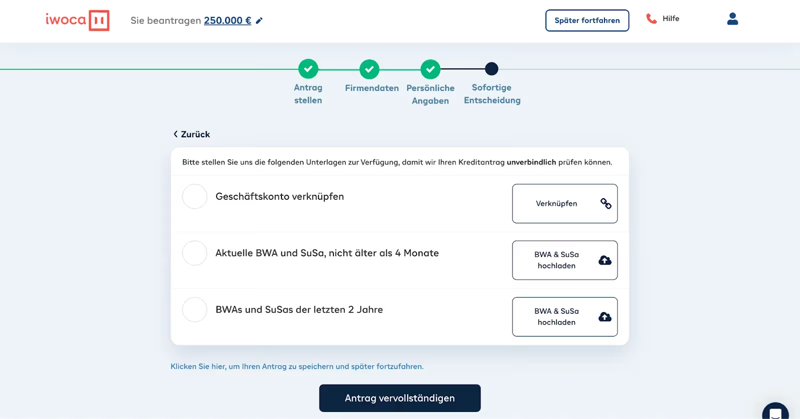

Источник: [BB-S0217](https://cdn.prod.website-files.com/63c34e378ffd315cda5f60b9/643e78b95fd2fc5ce063226a_b3e750d65639f65663fb2c69b084c8fd89f671ab726d605e05dd091d3e07108d370e08bcdd905dce79d49b902a2884841d3b111008bac94f64a045863fbb3def87eff4c3ed07924d0e1d3250c2bef150cfce4f5953e689dd1583e024b6a97a93308daaf6.avif). Проверка: 2026-10-07. Класс: официальная иллюстрация; для Wise — концептуальная схема. Подтверждаемая часть: Document checklist/account link. Этапы: BB-J0116. Не подтверждает фактическое исполнение или измеренный результат.

### BB-V0028 — iwoca / Германия

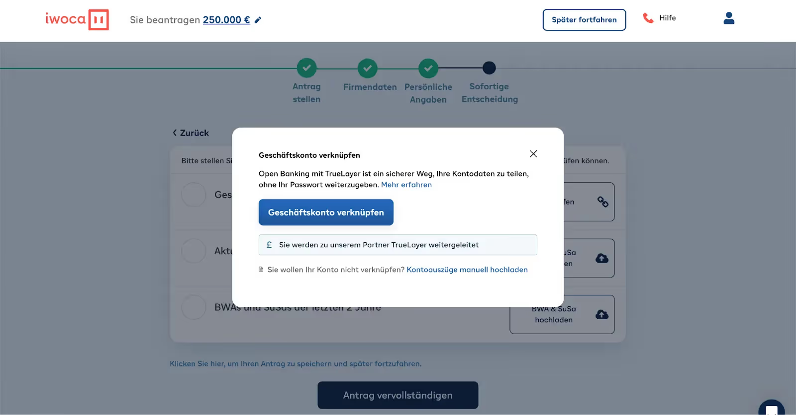

Источник: [BB-S0218](https://cdn.prod.website-files.com/63c34e378ffd315cda5f60b9/643e78b9ca79b1333b0196c2_73cfed355c6e5748ad1a7250403ffe5e16da84da3f35cec5c40c1e8854681767d3b9eb63aaf8d3f29cefab2ec0168fd393523fd738fc5bb62a540c54627a1a700b83daddb321809e6be824efddacfa28a61d6756ab5e7479b7f6138620a6bc1f2bf123e6.avif). Проверка: 2026-10-07. Класс: официальная иллюстрация; для Wise — концептуальная схема. Подтверждаемая часть: TrueLayer notice/manual alternative. Этапы: BB-J0117. Не подтверждает фактическое исполнение или измеренный результат.

### BB-V0029 — iwoca / Германия

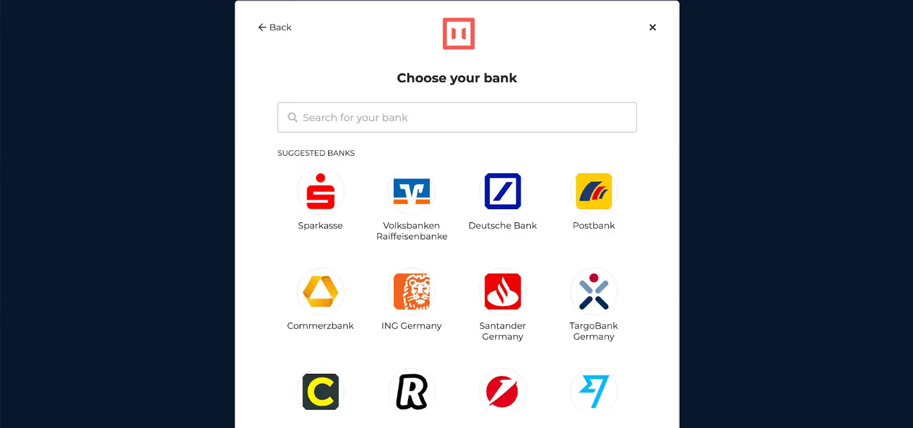

Источник: [BB-S0219](https://cdn.prod.website-files.com/63c34e378ffd315cda5f60b9/643e78b9b38dc5ca526bbf1d_715d33b3ca1704421851723af6cba7d3e58b49933259ccdd1a6ef55b21064408c0abce3f17e3ebd96aeabd8e93816e7de00193298b361d3bad78505ce5ee8dae00e6fa0d09bf99387c5f1327f1be0cce7771611d586c76d62a6e148dfa63b0da3b9db3b0.avif). Проверка: 2026-10-07. Класс: официальная иллюстрация; для Wise — концептуальная схема. Подтверждаемая часть: Bank selection. Этапы: BB-J0118. Не подтверждает фактическое исполнение или измеренный результат.

### BB-V0032 — YouLend / Великобритания

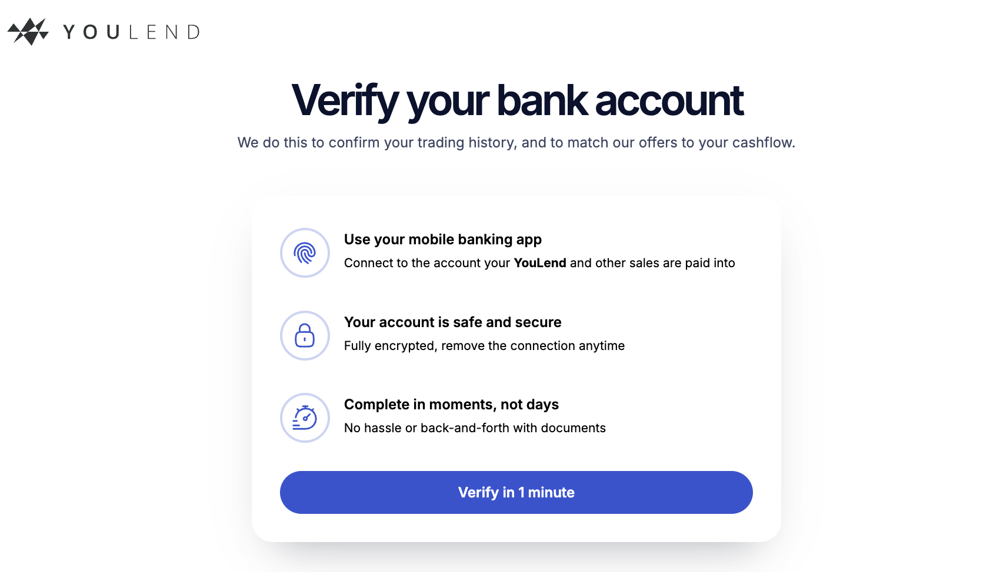

Источник: [BB-S0252](https://files.readme.io/70b56e047545023731bd0fd735b19cac84fbdeaac66d84c034355bfe1010b187-Screenshot_2025-08-06_at_09.49.02.png). Проверка: 2026-10-07. Класс: официальная иллюстрация; для Wise — концептуальная схема. Подтверждаемая часть: Verifybankentry. Этапы: BB-J0131. Не подтверждает фактическое исполнение или измеренный результат.

### BB-V0033 — YouLend / Великобритания

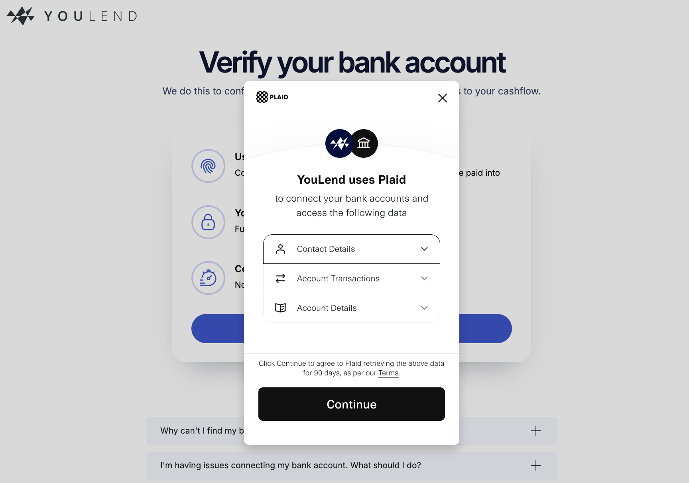

Источник: [BB-S0253](https://files.readme.io/e0053ddf43b0e0dae9060986c8cfa6121a7158f3cdd291df8b158e7886dd6bf7-Screenshot_2025-08-06_at_09.49.13.png). Проверка: 2026-10-07. Класс: официальная иллюстрация; для Wise — концептуальная схема. Подтверждаемая часть: Plaid data scope;sample90dayretrieval. Этапы: BB-J0132. Не подтверждает фактическое исполнение или измеренный результат.

### BB-V0034 — YouLend / Великобритания

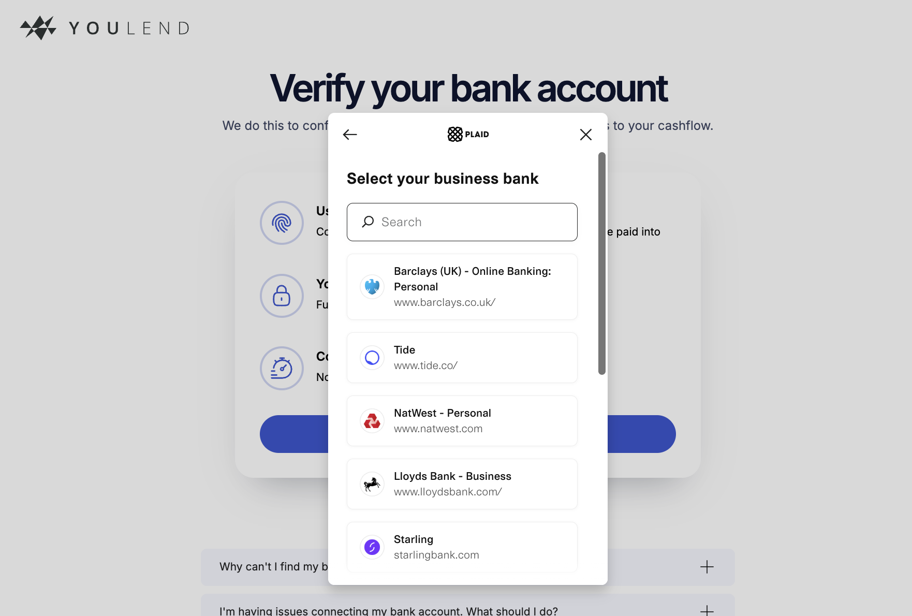

Источник: [BB-S0254](https://files.readme.io/e54df98575a4de92f36379a137ffeaa6a9110c4239c1a12820351eba9018e26a-Screenshot_2025-08-06_at_09.49.23.png). Проверка: 2026-10-07. Класс: официальная иллюстрация; для Wise — концептуальная схема. Подтверждаемая часть: UKbankselection. Этапы: BB-J0133. Не подтверждает фактическое исполнение или измеренный результат.

### BB-V0035 — YouLend / Великобритания

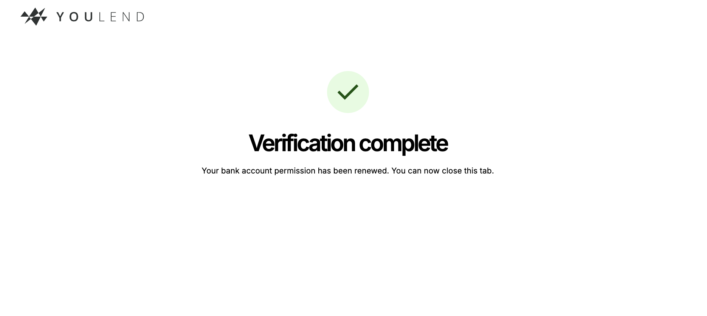

Источник: [BB-S0255](https://files.readme.io/6a3220149199da32e3343db20bedbe439ba5e4447d34068d63a95fb3a096398e-Screenshot_2025-08-06_at_09.49.50.png). Проверка: 2026-10-07. Класс: официальная иллюстрация; для Wise — концептуальная схема. Подтверждаемая часть: Permission renewed success wording. Этапы: BB-J0134. Не подтверждает фактическое исполнение или измеренный результат.

### BB-V0039 — Stone / Бразилия

Источник: [BB-S0278](https://martech-web-cdn.stone.com.br/incoming/stone/ff5bb063-6131-4513-a28a-4db751db571e/1.-Cap-Step-Desktop.jpg?h=540&w=660). Проверка: 2026-10-07. Класс: официальная иллюстрация; для Wise — концептуальная схема. Подтверждаемая часть: Loan banner/simulation action on account composite. Этапы: BB-J0157. Не подтверждает фактическое исполнение или измеренный результат.

### BB-V0040 — Stone / Бразилия

Источник: [BB-S0279](https://martech-web-cdn.stone.com.br/image-service/incoming/stone/ecd2e899-009f-429c-b07f-ffff1106006f/stone-limite-da-conta-1.jpg?h=600&w=660). Проверка: 2026-10-07. Класс: официальная иллюстрация; для Wise — концептуальная схема. Подтверждаемая часть: Available/withdrawn limit and withdraw action in official image. Этапы: BB-J0166. Не подтверждает фактическое исполнение или измеренный результат.

### BB-V0045 — RazorpayX / Индия

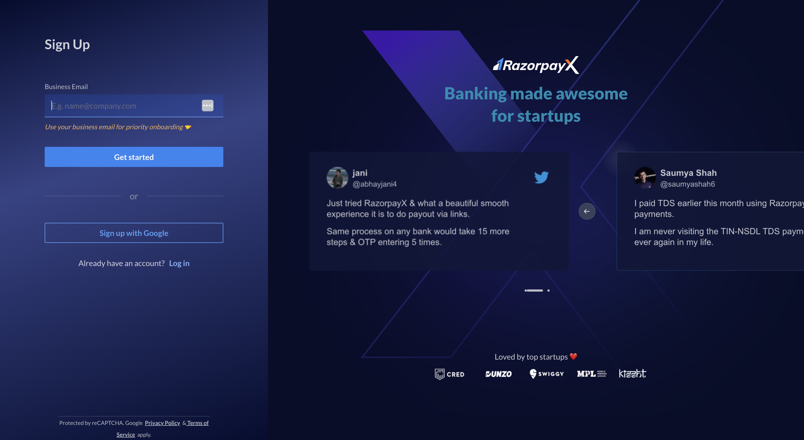

Источник: [BB-S0314](https://razorpay.com/docs/build/browser/assets/images/email.jpg). Проверка: 2026-10-07. Класс: официальная иллюстрация; для Wise — концептуальная схема. Подтверждаемая часть: Software registration email fields/actions in officialillustration. Этапы: BB-J0171. Не подтверждает фактическое исполнение или измеренный результат.

### BB-V0046 — RazorpayX / Индия

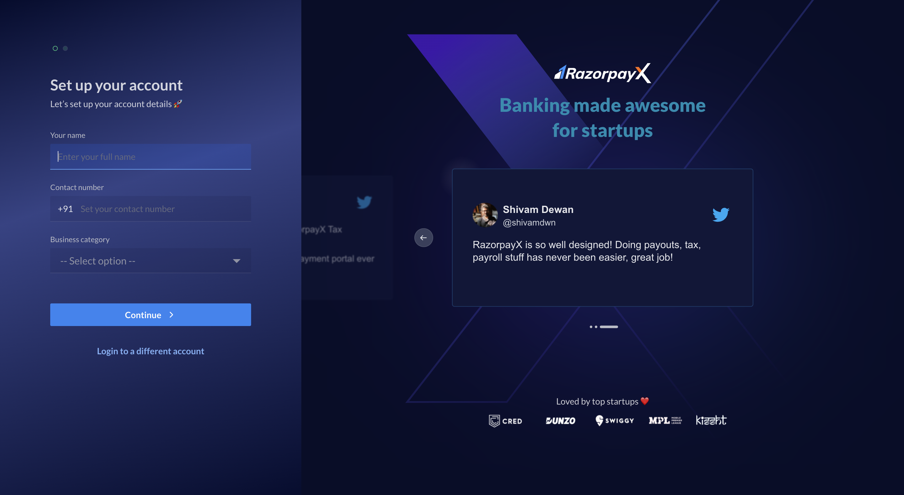

Источник: [BB-S0315](https://razorpay.com/docs/build/browser/assets/images/modified-pre-signup-flow.jpg). Проверка: 2026-10-07. Класс: официальная иллюстрация; для Wise — концептуальная схема. Подтверждаемая часть: Software registration profile fields/actions in officialillustration. Этапы: BB-J0172. Не подтверждает фактическое исполнение или измеренный результат.

### BB-V0047 — RazorpayX / Индия

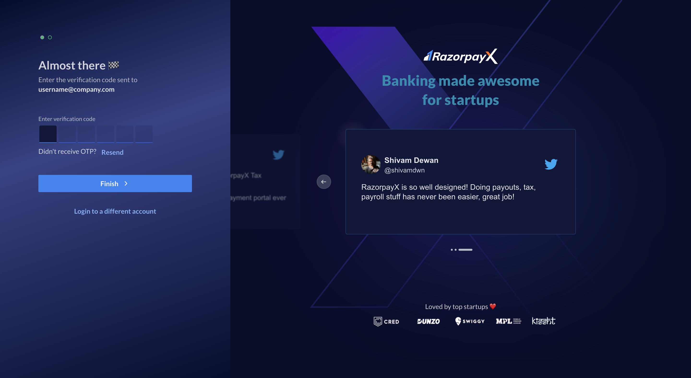

Источник: [BB-S0316](https://razorpay.com/docs/build/browser/assets/images/OTP.jpg). Проверка: 2026-10-07. Класс: официальная иллюстрация; для Wise — концептуальная схема. Подтверждаемая часть: Software registration verification fields/actions in officialillustration. Этапы: BB-J0173. Не подтверждает фактическое исполнение или измеренный результат.

### BB-V0053 — Airwallex / Австралия

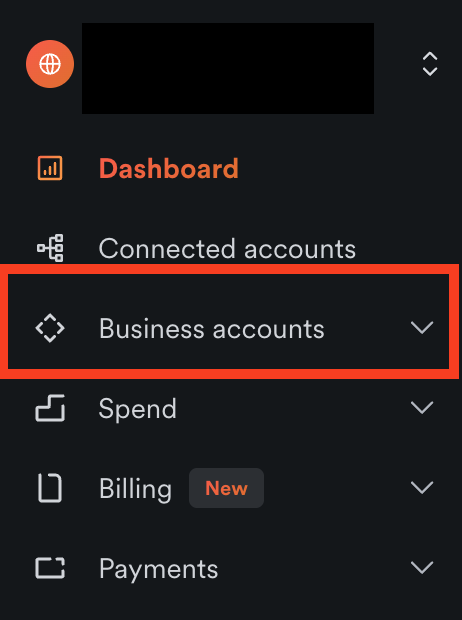

Источник: [BB-S0320](https://help.airwallex.com/hc/article_attachments/17116442409231). Проверка: 2026-10-07. Класс: официальная иллюстрация; для Wise — концептуальная схема. Подтверждаемая часть: Beta navigation marker Business Accounts. Этапы: BB-J0197. Не подтверждает фактическое исполнение или измеренный результат.

### BB-V0054 — Airwallex / Австралия

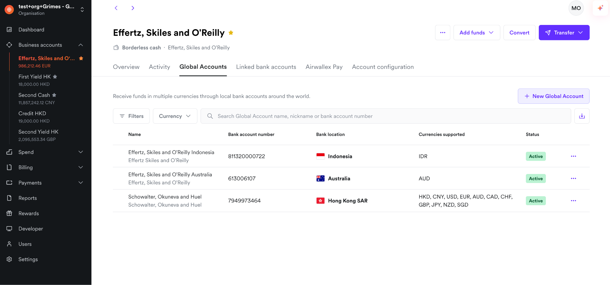

Источник: [BB-S0320](https://help.airwallex.com/hc/article_attachments/17116470139279). Проверка: 2026-10-07. Класс: официальная иллюстрация; для Wise — концептуальная схема. Подтверждаемая часть: Receiving-details list;AU row;mixed test balances and countries. Этапы: BB-J0197. Не подтверждает фактическое исполнение или измеренный результат.

### BB-V0055 — Airwallex / Австралия

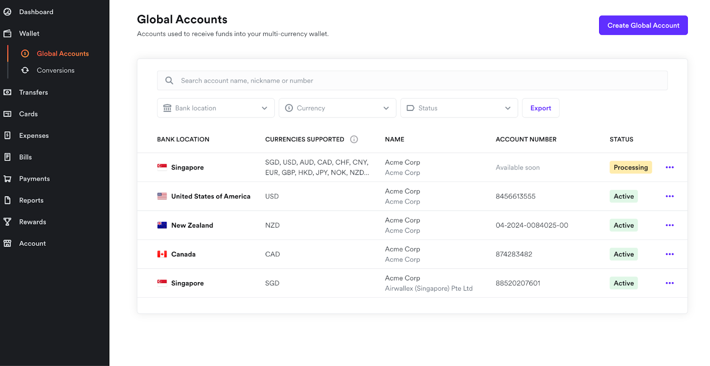

Источник: [BB-S0320](https://help.airwallex.com/hc/article_attachments/9974962385039). Проверка: 2026-10-07. Класс: официальная иллюстрация; для Wise — концептуальная схема. Подтверждаемая часть: Legacy Wallet/Global Accounts navigation alongside new experience. Этапы: BB-J0197. Не подтверждает фактическое исполнение или измеренный результат.

### BB-V0060 — Wise / Великобритания

Источник: [BB-S0362|BB-S0365](https://images.ctfassets.net/lbl105a14rhd/5t2tE6dJyqwDVUB7nxK1wu/06109bc52f91736f5535f24b522cc5e3/Screenshot_2025-08-27_at_10.27.40.png). Проверка: 2026-10-10. Класс: официальная иллюстрация; для Wise — концептуальная схема. Подтверждаемая часть: Структура Main account / Groups / Jars; официальная схема, не клиентский UI.. Этапы: BB-J0228|BB-J0229. Не подтверждает фактическое исполнение или измеренный результат.

## Покрытие и границы

Для компаний без сохранённых изображений использованы договоры и официальные инструкции; отсутствующий экран остаётся явным пробелом. Не дорисованы вход, кредитное решение, подпись или списание. Все записи, включая недоступные/несохранённые картинки, находятся в screens.csv; этапы — в journey_steps.csv. Само число записей не является числом пройденных путей.

Контрольные различия: Square и стандартный Toast Capital допускают внешний банк; Toast Bill Pay требует Checking. Mercury Working Capital оценивает до счёта, но выдаёт после открытия. Allica принимает заявление до BRA, но требует основной счёт до использования овердрафта. Tide Credit Flex в проверенном сценарии восстанавливает уже потраченные деньги. Wise не имеет кредитного перехода. Эти различия меняют точку измерения отказа и стоимость внедрения.

Для закрытых шагов следующая проверка требует законного доступа к демонстрации или собственному тестовому клиенту. До такого доступа заявления об UX, времени и поведении пользователей остаются недоказанными.
